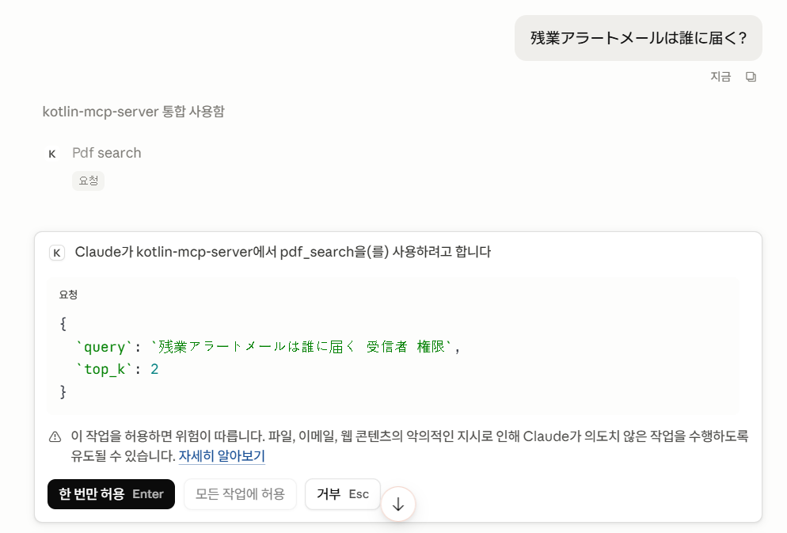
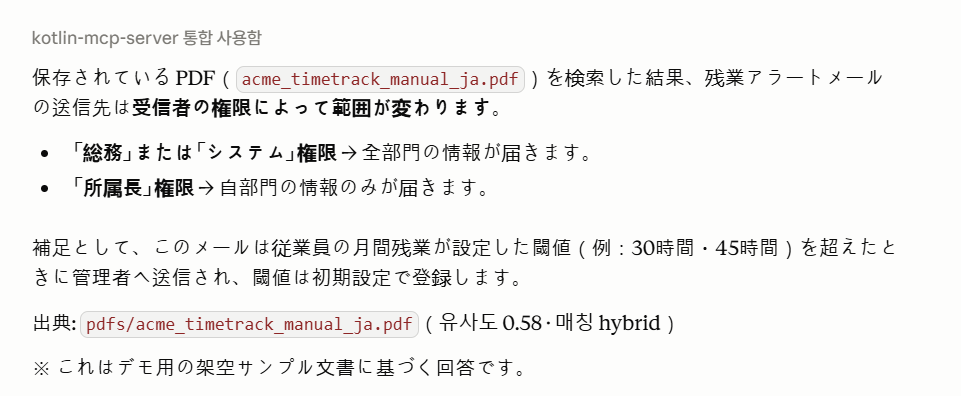

# MCP PDF 검색 서버 (Java/Kotlin)

[](https://github.com/wongi-jeong/mcp-java-kotlin-server/actions/workflows/ci.yml)
[](LICENSE)


📅 **2026.06** (약 3주)  ·  👤 **개인 프로젝트**

PDF를 업로드하면 자동으로 임베딩해 **의미 기반 벡터 검색**을 제공하는 MCP(Model Context Protocol) 서버입니다.
파일 진입점은 MinIO(S3 호환)로 단일화되어 있어, 버킷에 PDF를 올리기만 하면 웹훅으로 자동 색인됩니다.

> 🇯🇵 日本語版: [README.ja.md](README.ja.md) ・ 운영 배포(도메인+HTTPS): [DEPLOYMENT.md](DEPLOYMENT.md)

## 구성

| 서비스 | 역할 |
|---|---|
| **mcp-server** (Kotlin/Ktor) | MCP 서버. `http://localhost:3001/mcp` (Streamable HTTP). 도구: `pdf_search`, `echo`, `add` |
| **minio** (S3 호환) | PDF 저장소. `pdfs` 버킷에 업로드/삭제 시 웹훅으로 mcp-server에 이벤트 전달 |
| **ollama** | 임베딩 생성 (`nomic-embed-text`, 768차원) |
| **pgvector** (PostgreSQL) | 임베딩 벡터 저장·검색 (HNSW 인덱스) |
| **caddy** | (운영 전용) 실제 도메인 TLS 리버스 프록시. 로컬에선 미사용 |

**색인 흐름**: `pdfs` 버킷에 PDF 업로드 → MinIO 웹훅 → mcp-server가 자격증명으로 다운로드 → 청크 분할 → Ollama 임베딩 → pgvector 저장. 삭제하면 해당 벡터도 자동 정리됩니다. (클라이언트가 직접 호출하는 저장 도구는 없습니다.)

## 사전 요구사항

- **Docker** + **Docker Compose v2** (`docker compose`)
- 여유 디스크(임베딩 모델 ~300MB + 이미지) / 권장 RAM 4GB+ (Ollama는 CPU 추론)
- 로컬에서 사용하는 포트: `3001`(MCP), `9000`/`9001`(MinIO, 루프백), `5433`(Postgres)

## 빠른 시작 (로컬, 도메인 불필요)

```bash
bash scripts/quickstart.sh
```

이 스크립트가 자동으로: `.env` 생성(랜덤 자격증명) → 빌드·기동 → 샘플 PDF 업로드 → 스모크 테스트까지 수행합니다.
(최초 실행은 임베딩 모델 다운로드로 수 분 걸릴 수 있습니다.)

완료되면:

- **MCP 엔드포인트**: `http://localhost:3001/mcp`
- **MinIO 콘솔**: `http://localhost:9001` (ID `minioadmin` / PW는 `.env`의 `MINIO_ROOT_PASSWORD`)

### 수동으로 하려면

```bash
cp .env.example .env      # 값 편집(운영이면 반드시 비밀번호 교체)
docker compose up -d --build pgvector ollama minio minio-init mcp-server
```

로컬에서는 `docker-compose.override.yml`이 자동 병합되어 MinIO를 `localhost`에 노출하고 caddy는 띄우지 않습니다.

## 사용법

### 1) PDF 추가

MinIO 콘솔(`http://localhost:9001`)에서 `pdfs` 버킷에 PDF를 드래그&드롭하면 자동 색인됩니다.
스코프 계정을 쓰려면 `.env`의 `pdf-uploader` 키로 로그인하세요. `mc`나 S3 SDK로 올려도 됩니다.

### 2) 검색 (MCP 도구)

MCP 클라이언트(예: Claude 데스크톱/Cowork 커넥터)를 `http://localhost:3001/mcp`에 연결하면 아래 도구가 노출됩니다.

| 도구 | 파라미터 | 설명 |
|---|---|---|
| `pdf_search` | `query`(필수), `top_k`(기본 5), `min_score`(기본 0.6) | 하이브리드 검색(벡터 유사도 + 키워드). `min_score` 미만의 순수 벡터 결과는 제외(키워드 매칭은 유지) |
| `echo` | `message` | 입력 그대로 반환 (연결 확인용) |
| `add` | `a`, `b` | 두 수의 합 (연결 확인용) |

> 팁: 문서가 일본어면 **일본어로 질의**할 때 정확도가 가장 높습니다. 결과가 적으면 `min_score`를 0.4~0.5로 낮추고, 정밀도가 필요하면 0.65~0.7로 올리세요.

## 데모

샘플 PDF(`pdfs/samples/`)가 색인된 상태에서 MCP 클라이언트로 `pdf_search`를 호출한 예시입니다.


*① MCP 클라이언트가 `pdf_search`를 호출 — 질의와 top_k 파라미터.*


*② 검색된 청크로 답변 — 출처·유사도·매칭 경로(hybrid) 표시.*

아래는 텍스트로 본 검색 예시입니다. (점수·청크 번호는 예시이며 환경에 따라 달라집니다.)


```text
# 의미 + 키워드 하이브리드 (일본어 질의)
pdf_search(query="残業アラートメールは誰に届きますか？", top_k=2)

[pdfs/samples/acme_timetrack_manual_ja.pdf | 청크 #0 | 유사도 0.71 | 매칭 hybrid]
受信者の権限が「総務」または「システム」のとき全部門の情報が、
「所属長」のとき自部門の情報のみが送信されます。

# 교차 언어 (한국어 질의 → 일본어 문서 회수)
pdf_search(query="야간 근무 시간은 어떻게 집계돼?", top_k=1)

[pdfs/samples/acme_timetrack_manual_ja.pdf | 청크 #0 | 유사도 0.63 | 매칭 vector]
設定した開始・終了の間の労働時間を「深夜」時間として集計します。

# 무관한 질의는 컷오프(min_score)로 제외
pdf_search(query="회사 주차장 이용 규정", min_score=0.6)
→ 검색 결과가 없습니다.
```

## 스모크 테스트

```bash
bash scripts/smoke_test.sh
```

`pdf_chunks` 테이블에 임베딩 청크가 생겼는지(=업로드→웹훅→임베딩 파이프라인 동작) 확인하고 문서별 청크 수를 출력합니다.

## 운영 배포

실제 도메인 + 자동 HTTPS(Caddy) + 보안 하드닝은 [DEPLOYMENT.md](DEPLOYMENT.md)를 참고하세요. 로컬 오버라이드 없이 운영용으로만 띄우려면:

```bash
docker compose -f docker-compose.yml up -d --build
```

## 문제 해결

- **`password authentication failed for user "postgres"`**
  `.env`의 `DB_PASSWORD`를 바꿨는데 `pgvector` 볼륨이 옛 비밀번호로 이미 초기화된 경우입니다. Postgres는 볼륨 최초 생성 시에만 비밀번호를 설정합니다. 데이터 유지: `docker compose exec pgvector psql -U postgres -c "ALTER USER postgres PASSWORD '새값';"` 후 `docker compose restart mcp-server`. 초기화해도 되면 `docker compose down && docker volume rm <프로젝트>_pgvector_data`.
- **MCP 클라이언트에서 `min_score` 등 새 파라미터가 안 먹음**
  재빌드 후 클라이언트가 옛 도구 스키마를 캐시한 경우입니다. **클라이언트를 재연결**하면 새 스키마를 다시 불러옵니다.
- **첫 검색이 타임아웃**
  Ollama 모델 cold start입니다. 잠시 후 다시 시도하면 정상 응답합니다.
- **채팅에서 `pdf_search`가 호출되지 않음**
  "저장된 PDF/매뉴얼에서 ~ 찾아줘"처럼 **문서 검색 의도를 명시**하세요.
- **MinIO 콘솔 접속 불가(localhost:9001)**
  로컬에선 `docker-compose.override.yml`이 있어야 포트가 노출됩니다. `docker compose port minio 9001`로 확인.

## 저장소 구조

```
docker-compose.yml            # 전체 스택 (운영 기준)
docker-compose.override.yml   # 로컬 전용 오버라이드 (localhost 노출, caddy 미기동)
.env.example                  # 환경변수 템플릿 (비밀값은 .env, gitignored)
caddy/Caddyfile               # (운영) 리버스 프록시 설정
minio/provision.sh            # 버킷·정책·서비스 계정 프로비저닝(1회성)
scripts/quickstart.sh         # 원커맨드 로컬 실행
scripts/smoke_test.sh         # 파이프라인 스모크 테스트
java-server/                  # 임베딩·저장·검색 로직 (Java)
kotlin-server/                # MCP 서버·도구·웹훅 (Kotlin)
pdfs/                         # 샘플 PDF
DEPLOYMENT.md                 # 운영 배포·보안 하드닝 가이드
```
